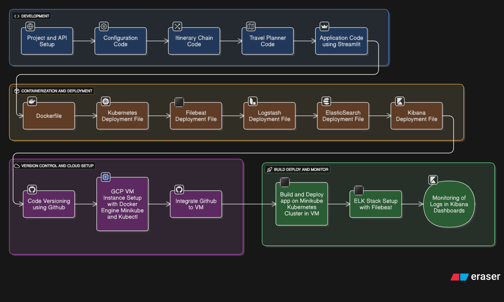
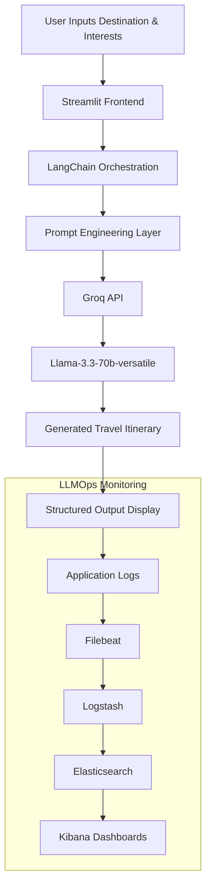

<div align="center">

# 🌍 AI Travel Itinerary Planner  
### Enterprise-Grade LLM-Powered Intelligent Travel Planning System



<br>

[](https://www.python.org/)
[](https://streamlit.io/)
[](https://langchain.com/)
[](https://groq.com/)
[](https://www.docker.com/)
[](https://kubernetes.io/)
[](https://www.elastic.co/)
[](https://www.elastic.co/logstash)
[](https://www.elastic.co/kibana)
[](https://www.elastic.co/beats/filebeat)

### Intelligent LLM-Powered Travel Assistant leveraging LangChain, Groq, Kubernetes & ELK-based LLMOps Observability

</div>

---

# 📚 Table of Contents

- Executive Overview
- Business Problem
- Core Features
- AI & LLM Engineering
- Architecture Workflow
- Technical Stack
- Project Structure
- AI Workflow Lifecycle
- Deployment Outputs
- Monitoring & Observability
- Security Features
- Quick Start
- Kubernetes Deployment
- Engineering Highlights
- Real-World Use Cases
- Future Enhancements
- Infrastructure Documentation
- License

---

# 📖 Executive Overview

The **AI Travel Itinerary Planner** is a production-grade Generative AI application engineered to dynamically generate personalized travel itineraries using state-of-the-art Large Language Models.

The system intelligently analyzes:
- Travel destinations
- User interests
- Trip preferences
- Travel categories
- Contextual travel requirements

to generate highly relevant, structured, and personalized travel plans in real time.

Powered by:
- **LangChain orchestration**
- **Groq ultra-fast inference**
- **Llama-3.3-70b-versatile**
- **Kubernetes deployment**
- **ELK Stack observability**

the repository demonstrates modern enterprise-grade:
- Generative AI Engineering
- LLMOps
- MLOps
- Kubernetes Infrastructure
- Cloud-Native Deployment
- Centralized Monitoring & Logging

---

# 🎯 Business Problem

Traditional travel recommendation systems rely heavily on static APIs and rule-based systems that fail to provide personalized and context-aware itineraries.

This project solves those limitations by:
- Leveraging advanced LLM reasoning
- Dynamically generating itineraries
- Supporting contextual understanding
- Producing structured travel recommendations
- Providing scalable cloud-native deployment workflows

The system bridges the gap between:
- AI personalization
- Real-time recommendation generation
- Enterprise infrastructure deployment
- Production observability

---

# 🌟 Core Features

## 🤖 Generative AI & LLM Features

- Intelligent itinerary generation using `llama-3.3-70b-versatile`
- Groq-powered ultra-low latency inference
- Dynamic prompt orchestration using LangChain
- Context-aware travel recommendation generation
- Structured itinerary responses
- Prompt-engineered travel planning workflows
- Flexible and modular chain-based architecture

---

## ⚙️ Infrastructure & Deployment Features

- Dockerized application runtime
- Kubernetes-native deployments
- Self-healing orchestration workflows
- Cloud-ready infrastructure
- Environment-driven configurations
- Kubernetes Secrets integration
- Modular deployment manifests

---

## 👁️ Observability & Monitoring Features

- Centralized ELK stack logging
- Kubernetes-wide Filebeat telemetry collection
- Elasticsearch indexing
- Kibana dashboards
- Distributed log aggregation
- Real-time infrastructure monitoring
- Production observability workflows

---

# 🧠 AI & LLM Engineering

## Model Used

```python
llama-3.3-70b-versatile
```

via:
- Groq API
- LangChain-Groq integration

---

## LangChain Capabilities

The system utilizes LangChain for:
- Prompt orchestration
- LLM communication
- Chain execution
- Structured output handling
- AI workflow modularity

---

## Prompt Engineering Pipeline

The application incorporates:
- Structured travel prompts
- Controlled itinerary generation
- Context-aware prompt templates
- Safe and deterministic response formatting

---

# 🏛️ Architecture Workflow


---

# 🔄 AI Workflow Lifecycle



---

# 🏗️ Technical Stack

| Category | Technologies Used |
|----------|------------------|
| **Language** | Python 3.10 |
| **Frontend** | Streamlit |
| **LLM Framework** | LangChain |
| **LLM Provider** | Groq |
| **Model** | Llama-3.3-70b-versatile |
| **Containerization** | Docker |
| **Orchestration** | Kubernetes |
| **Cloud Infrastructure** | GCP VM / Minikube |
| **Monitoring** | Elasticsearch |
| **Log Processing** | Logstash |
| **Visualization** | Kibana |
| **Log Collection** | Filebeat |

---

# 📂 Project Structure

```text
.
├── Architecture/                   # Architectural workflow diagrams
├── Output/                         # Deployment screenshots & outputs
├── src/
│   ├── chains/
│   │   └── itinerary_chain.py      # LangChain + Groq orchestration
│   ├── config/
│   │   └── config.py               # Environment configuration
│   ├── core/
│   │   └── planner.py              # Core itinerary generation logic
│   └── utils/
│       ├── custom_exception.py     # Exception handling utilities
│       └── logger.py               # Application logging utilities
│
├── app.py                          # Streamlit application entry point
├── Dockerfile                      # Container configuration
├── requirements.txt                # Python dependencies
├── setup.py                        # Package installation configuration
├── k8s-deployment.yaml             # Kubernetes deployment manifests
├── elasticsearch.yaml              # Elasticsearch deployment
├── filebeat.yaml                   # Filebeat DaemonSet configuration
├── logstash.yaml                   # Logstash deployment
├── kibana.yaml                     # Kibana dashboard deployment
└── FULL DOCUMENTATION.md           # Infrastructure & deployment guide
```

---

# 📊 Deployment & Outputs

The repository contains extensive deployment screenshots and infrastructure outputs demonstrating successful deployment and execution.

## Included Output Demonstrations

### 🚀 Application Deployment
- Build and deployment workflows
- Streamlit application outputs
- Production execution screenshots

### 🐳 Docker Infrastructure
- Docker image setup
- Containerized execution workflows

### ☸️ Kubernetes Deployment
- Kubernetes pod deployments
- Cluster orchestration setup
- Minikube initialization

### 📈 ELK Stack Deployment
- Elasticsearch provisioning
- Kibana dashboards
- Centralized logging infrastructure

---

# 📸 Visual Demonstrations

<details>
<summary><b>📷 View Deployment Screenshots</b></summary>

---

## 🏠 Application Interface


---

## 🐳 Docker Setup


---

## ☸️ Kubernetes Deployment


---

## 📊 Elasticsearch Deployment


---

## 📈 Kibana Dashboard


---

## 🖥️ VM Infrastructure


</details>

---

# 📊 Monitoring & Observability

The project implements centralized observability using the ELK Stack.

## Elasticsearch
- Distributed indexing
- Real-time search capabilities
- Persistent telemetry storage

## Logstash
- Centralized log processing
- Data ingestion pipelines
- Structured log transformation

## Kibana
- Dashboard visualization
- Infrastructure monitoring
- Real-time observability

## Filebeat
- Node-level log shipping
- Kubernetes telemetry collection
- Lightweight daemon execution

---

# 🔐 Security Features

The system follows production-grade security practices:

- `.env` based secret management
- Kubernetes Secrets integration
- Environment isolation
- Secure runtime configurations
- API key protection
- Modular configuration handling

---

# 🚀 Quick Start (Local Setup)

## 1️⃣ Clone Repository

```bash
git clone https://github.com/pamuarun/AI-TRAVEL-PLANNER.git
cd AI-TRAVEL-PLANNER
```

---

## 2️⃣ Configure Environment Variables

Create a `.env` file:

```env
GROQ_API_KEY=your_api_key_here
```

---

## 3️⃣ Install Dependencies

```bash
pip install -r requirements.txt
pip install -e .
```

---

## 4️⃣ Run Application

```bash
streamlit run app.py
```

---

# ☸️ Kubernetes Deployment

## Deploy Application

```bash
kubectl apply -f k8s-deployment.yaml
```

---

## Deploy ELK Stack

```bash
kubectl apply -f elasticsearch.yaml
kubectl apply -f logstash.yaml
kubectl apply -f kibana.yaml
kubectl apply -f filebeat.yaml
```

---

# 📈 Engineering Highlights

- Enterprise-grade LLMOps workflows
- Production-ready Kubernetes deployment
- Centralized logging architecture
- Cloud-native AI engineering
- Distributed observability stack
- Modular LangChain orchestration
- Dockerized runtime environments
- Scalable deployment pipelines
- Production-focused infrastructure design

---

# 🌍 Real-World Use Cases

- Personalized travel planning
- AI tourism assistants
- Smart itinerary generation
- Conversational travel recommendation systems
- AI-powered tourism platforms
- Intelligent travel automation

---

# 🚀 Future Enhancements

- Multi-agent travel orchestration
- RAG-powered travel retrieval systems
- Vector database integration
- AI memory systems
- Personalized recommendation learning
- User authentication & analytics
- Multi-LLM routing
- Voice-enabled itinerary assistant
- Cloud autoscaling infrastructure
- Real-time travel API integration

---

# 📖 Infrastructure Documentation

A complete infrastructure and deployment guide is available in:

```text
FULL DOCUMENTATION.md
```

The documentation includes:
- GCP VM setup
- Docker installation
- Kubernetes deployment
- ELK stack configuration
- Filebeat setup
- Kibana dashboards
- Production deployment workflows
- Infrastructure setup lifecycle

---

# 📜 License

This project is licensed under the MIT License.

---

<p align="center">
Built with ❤️ using Generative AI, Kubernetes, ELK, LangChain & Enterprise LLMOps
</p>
````
